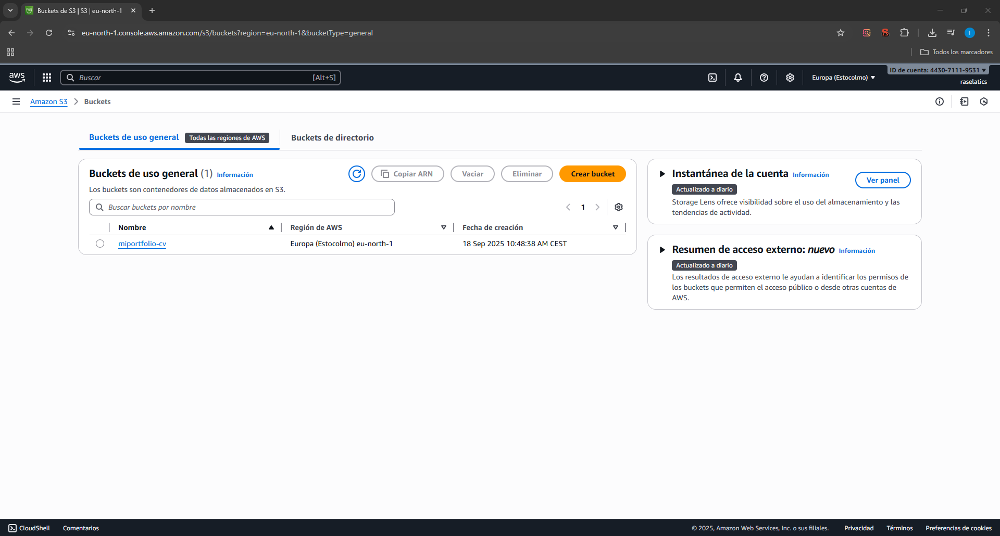
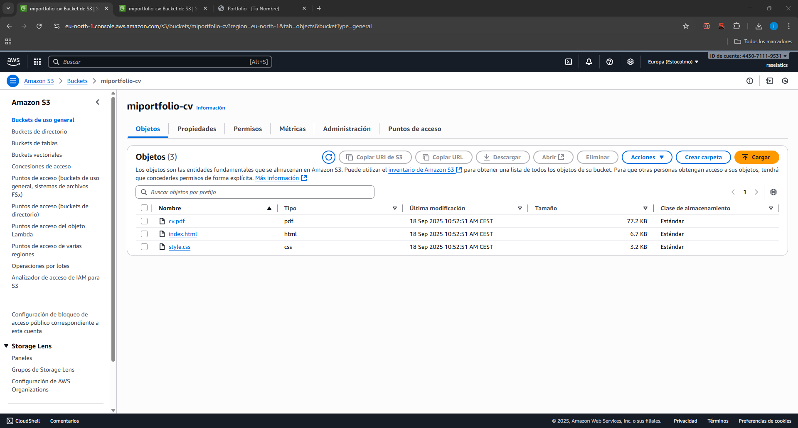
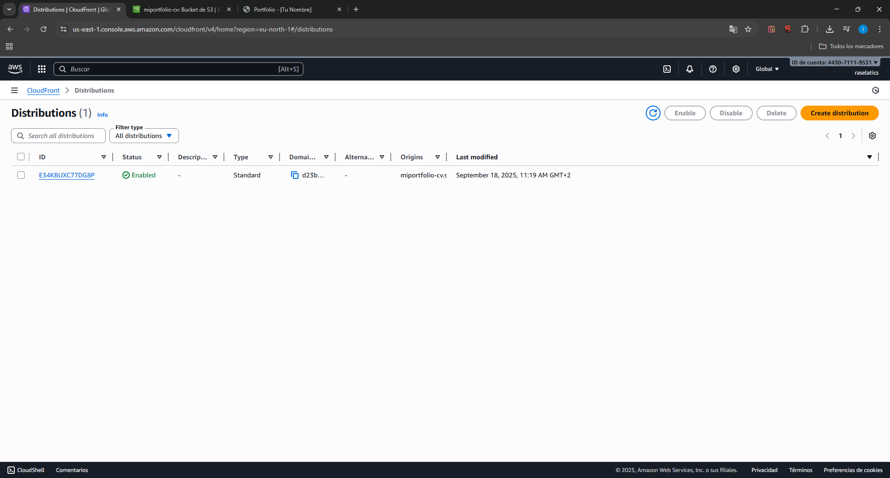
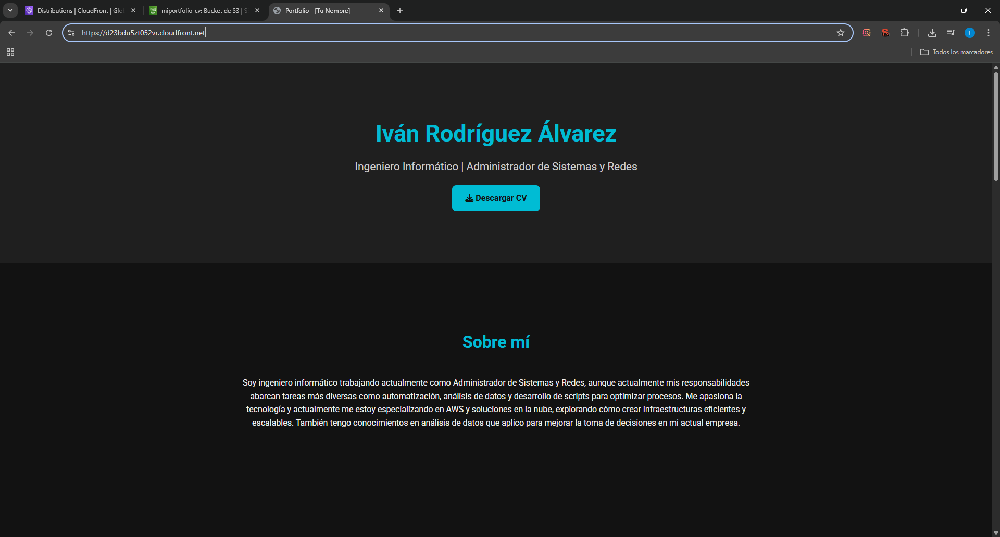

# 🌐 Portfolio Web Desplegada en AWS

Este proyecto consiste en el despliegue de una web estática personal usando Amazon S3 y CloudFront, dentro de la Free Tier de AWS.

---

## 🚀 Objetivo
- Publicar una web estática accesible globalmente.  
- Practicar con servicios de AWS: S3 y CloudFront.  
- Aprender conceptos de infraestructura en la nube y CDN.

---

## 🛠️ Servicios utilizados
- **Amazon S3** → Almacenamiento de archivos de la web (HTML, CSS, imágenes).  
- **CloudFront** → Distribución global de contenido con HTTPS gratuito.  
- **Bucket Policy** → Configuración de acceso público a los archivos del bucket.

---

## 📂 Estructura del proyecto
```bash
📁 mi-portfolio
 ├── index.html
 ├── style.css
 ├── script.js
 ├── assets/
 │    ├── foto.jpg
 │    └── iconos/
 └── images/
      ├── s3-bucket.png
      ├── s3-website.png
      ├── cloudfront.png
      ├── web-https.png
```

## 📌 Pasos principales
1. Configuración del bucket S3

- Crear bucket en S3 con nombre único.

- Activar Static Website Hosting.

- Subir los archivos de la web (index.html, CSS, imágenes).

- Configurar Bucket Policy para permitir acceso público:
{
 "Version": "2012-10-17",
 "Statement": [
   {
     "Sid": "PublicReadGetObject",
     "Effect": "Allow",
     "Principal": "*",
     "Action": "s3:GetObject",
     "Resource": "arn:aws:s3:::miportfolio-cv/*"
   }
 ]
}

2. Configuración de CloudFront

- Crear una distribución Web en CloudFront.

- Origin Domain → pegar el S3 Website Endpoint (miweb.s3-website-<region>.amazonaws.com).

- Default Root Object → index.html.

- Custom Domain → dejar vacío (no hay dominio propio).

- SSL Certificate → Default CloudFront Certificate (*.cloudfront.net).

- WAF → None (gratis).

- Esperar a que la distribución se despliegue.

## 🔗 URL pública

Acceso a la web vía CloudFront:

https://d23bdu5zt052vr.cloudfront.net/